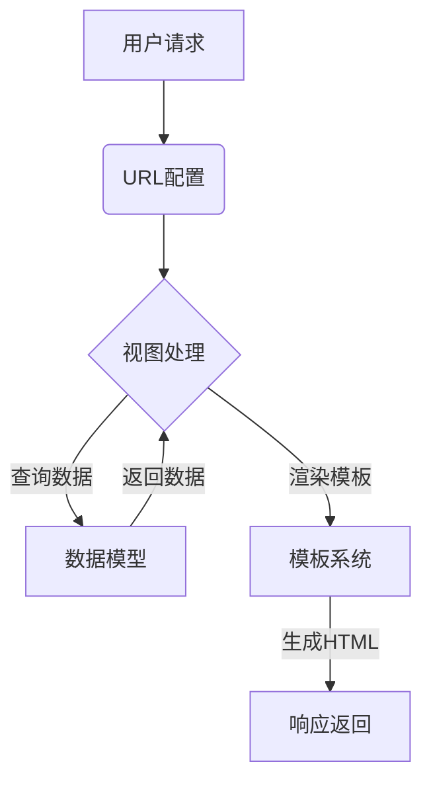

# Django Blog 项目注释文档

## 项目架构说明



## 模块注释索引

### 核心配置

- `settings.py`：项目全局设置（数据库/中间件/模板等）
- `urls.py`：URL入口配置

### 应用模块

- `posts/`：博客功能模块
  - `models.py`：文章数据模型定义
  - `views.py`：请求处理逻辑
  - `admin.py`：后台管理配置

### 模板系统

- `base.html`：基础模板框架
- 继承机制：子模板通过复用布局

## 关键配置说明

1. **数据库配置**

```
SQLite默认配置
数据存储路径：/db.sqlite3
自动创建数据库表
```

2. **静态文件处理**

```
开发模式自动服务静态文件
生产环境需配置Nginx/Apache
```

[//]: # (持续更新维护，与代码版本保持同步)
